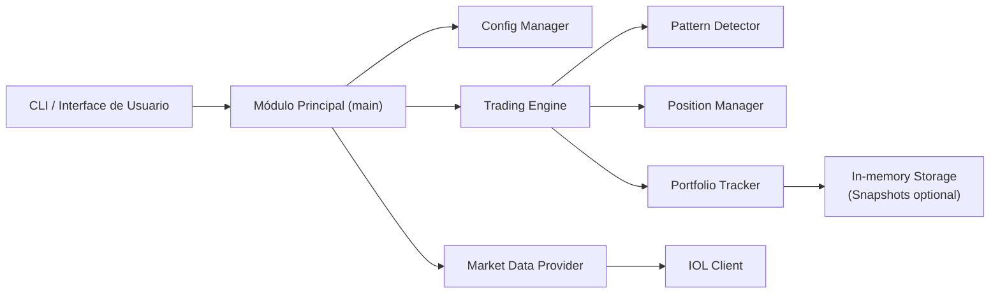
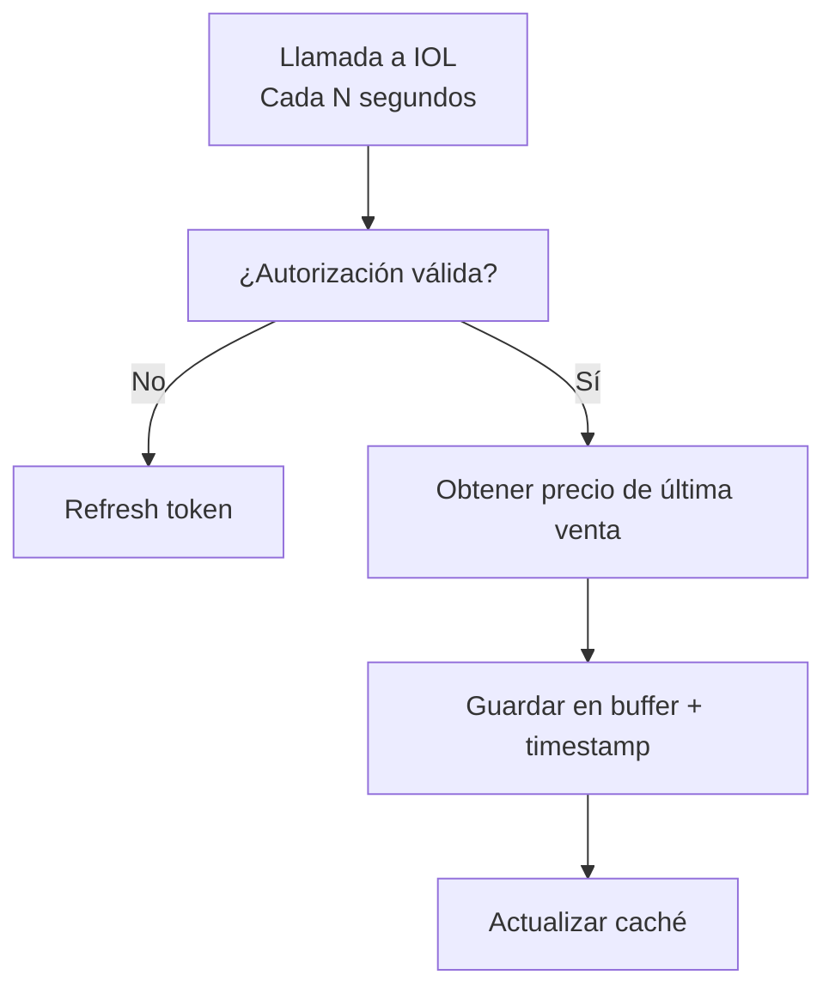
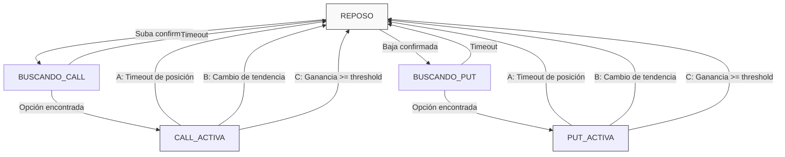

# Arquitectura - Sistema Automático de Trading de Opciones en Invertir Online

**Versión:** 1.0  
**Fecha:** Agosto 2026  
**Lenguaje:** Rust  
**Propósito:** Bot de trading automático de opciones con inteligencia en patrones de suba/baja

---

## 1. Visión General

Sistema de trading automático que monitorea el precio de acciones en Invertir Online, detecta patrones sostenidos de suba o baja, ejecuta operaciones de opciones (calls para movimientos alcistas, puts para bajistas) y gestiona la salida de posiciones basada en criterios de ganancia mínima (covering de comisiones) o cambios de tendencia.

**Objetivo principal:** Automatizar el trading de opciones minimizando latencia y maximizando confiabilidad.

---

## 2. Arquitectura General



---

## 3. Componentes Principales

### 3.1 Módulo de Configuración (`config/`)

**Responsabilidad:** Centralizar y validar toda la configuración desde variables de ambiente.

**Variables de Ambiente:**

```plaintext
# Credenciales IOL
IOL_USERNAME=tu_usuario
IOL_PASSWORD=tu_contraseña
IOL_REFRESH_TOKEN=token_inicial_refresh

# Parámetros de operación
TICKER=GAL                          # Ticker base (configurable)
CHECK_INTERVAL_SECS=5              # Intervalo de chequeo de precio (segundos)
PRICE_HISTORY_MINUTES=30           # Período de histórico para detectar tendencia
MIN_SAMPLES_FOR_TREND=5            # Cantidad mínima de muestras para confirmar tendencia
TREND_CHANGE_SAMPLES=3             # Muestras para confirmar cambio de tendencia

# Parámetros económicos
COMMISSION_PERCENTAGE=0.19         # Comisión en porcentaje (default 0.19% IOL)
TAX_PERCENTAGE=0.35                # Impuesto sobre ganancias (default 35% Argentina)
MIN_PROFIT_MULTIPLIER=2.0          # Ganancia mínima = (Comisión + Impuestos) * este factor

# Parámetros técnicos
LOG_LEVEL=info                     # debug, info, warn, error
MAX_CONCURRENT_REQUESTS=10         # Conexiones simultáneas a IOL
CACHE_TTL_SECS=60                  # TTL de caché de datos

# Parámetros de opciones
OPTION_EXPIRY_DAYS=1              # Preferencia de vencimiento (1=hoy, 7=1 semana)
MAX_POSITION_SIZE=5               # Máximo número de contratos por posición
POSITION_TIMEOUT_MINS=60          # Tiempo máximo de espera para cierre de posición
```

**Estructura de datos:**
- Validación exhaustiva en startup
- Fallback a valores por defecto
- Hot-reload seguro para cambios no críticos

---

### 3.2 Módulo de Datos de Mercado (`market/`)

**Responsabilidad:** Obtener datos de precio en tiempo real desde IOL, con manejo de conexión y caché inteligente.

**Subcomponentes:**

#### 3.2.1 IOL API Client
- Autenticación OAuth 2.0 con refresh automático de tokens
- Conexiones con retry exponencial y circuit breaker
- Rate limiting respetando límites de IOL
- Deserialización eficiente de JSON

#### 3.2.2 Price Stream Manager
- Buffer de últimos N precios (ventana deslizante)
- Timestamp preciso para cálculos de tendencia
- Detección de gaps o datos faltantes

#### 3.2.3 Cache Layer
- Cache en memoria para datos recientes (TTL configurable)
- Fallback local si se pierde conexión (5 minutos máximo)
- Invalidación selectiva por símbolo

**Diagrama de flujo:**



---

### 3.3 Módulo Detector de Patrones (`pattern/`)

**Responsabilidad:** Detectar tendencias sostenidas (suba o baja) basadas en histórico reciente.

**Algoritmo de Tendencia:**

1. **Recolección de muestras:** Últimas N muestras de precio dentro de la ventana temporal
2. **Cálculo de dirección:** 
   - Suba: Precio actual > promedio móvil de últimas N muestras
   - Baja: Precio actual < promedio móvil de últimas N muestras
3. **Confirmación:** Requiere `MIN_SAMPLES_FOR_TREND` lecturas consecutivas en la misma dirección
4. **Cambio de tendencia:** Detección cuando se invierten `TREND_CHANGE_SAMPLES` muestras

**Estadísticas calculadas:**
- Pendiente de la tendencia (velocidad)
- Volatilidad (desviación estándar)
- Fuerza del patrón (R² del ajuste lineal)

---

### 3.4 Módulo de Motor de Trading (`trading/`)

**Responsabilidad:** Lógica central de decisión de compra, venta y gestión de posiciones.

#### 3.4.1 Estado Máquina de Trading




#### 3.4.2 Position Manager

**Ciclo de vida de una posición:**

1. **Búsqueda:** Consultar opciones disponibles para el ticker
2. **Selección:** Elegir strike más cercano al precio actual
3. **Compra:** Ejecutar orden limitada
4. **Monitoreo:** Seguimiento de P&L en tiempo real
5. **Salida:** Cierre por ganancia mínima, cambio de tendencia o timeout

**Cálculo de P&L:**

```plaintext
Ganancia Bruta = (Precio Venta - Precio Compra) × Contratos

Comisión Total = Ganancia Bruta × (COMMISSION_PERCENTAGE / 100)
                + Ganancia Bruta × (COMMISSION_PERCENTAGE / 100)  [Compra y Venta]

Impuesto = Ganancia Bruta × (TAX_PERCENTAGE / 100)

Ganancia Neta = Ganancia Bruta - Comisión Total - Impuesto

Condición de Salida = Ganancia Neta >= (Comisión Total + Impuesto) × MIN_PROFIT_MULTIPLIER
```

---

### 3.5 Módulo de Seguimiento de Portafolio (`portfolio/`)

**Responsabilidad:** Mantener estado actual de posiciones, histórico de operaciones y métricas.

**Datos registrados:**
- Operaciones ejecutadas (timestamp, tipo, precio, cantidad)
- Posiciones actuales (activas, moneda, delta)
- Histórico de tendencias detectadas
- Métricas de performance

**Persistencia:**
- Estado y histórico mantenidos en memoria (no usar base de datos por defecto)
- Snapshots periódicos opcionales (JSON compresible) para recuperación
- Journal append-only en disco opcional para replay y auditoría
- Diseñado para que el proceso sea suficiente para operaciones en desarrollo y testing; producción puede habilitar snapshots/replicación según necesidad

---

### 3.6 Módulo de Persistencia (`persistence/`)

**Responsabilidad:** Mantener en memoria (thread-safe) el estado del bot: posiciones activas, histórico de operaciones, métricas y buffer de precios. Proveer snapshots y journal opcionales para recuperación.

**Estrategia (sin DB por defecto):**

- Almacenamiento principal: estructuras en memoria (DashMap/Mutex + vectores) para acceso rápido y concurrencia segura.
- Persistencia opcional: snapshots periódicos (JSON.gz) y journal append-only para auditoría y replay.
- Consistencia: operaciones críticas actualizan el estado en memoria y escriben una entrada de journal atomically.
- Recuperación: al startup, cargar snapshot más reciente y reprocesar journal para alcanzar estado actual.

**Notas:**
- Evitar dependencias externas para simplicidad operacional en entornos locales y de pruebas.
- Si se requiere persistencia fuerte en producción, integrar un backend separado (por ejemplo una cola o servicio persistente) sin acoplar la lógica de trading.

---

## 4. Flujos de Negocio Principales

### 4.1 Flujo de Detección de Tendencia y Ejecución

```mermaid
flowchart TD
  Inicio[Inicio] --> Obtener[Obtener precio actual (cada CHECK_INTERVAL_SECS)]
  Obtener --> Agregar[Agregar a buffer histórico]
  Agregar --> Calcular[Calcular tendencia]
  Calcular -->|suba confirmada| BuscarCall[BUSCAR_CALL]
  Calcular -->|baja confirmada| BuscarPut[BUSCAR_PUT]
  BuscarCall --> ConsultarOpc[Consultar opciones disponibles]
  ConsultarOpc --> Filtrar[Filtrar por vencimiento y strike]
  Filtrar --> Seleccionar[Seleccionar mejor opción]
  Seleccionar --> Ejecutar[Ejecutar compra limitada]
  Ejecutar --> Activa[ACTIVA / inicio de monitoreo]
  Activa --> Monitorear[Monitorear precio de opción en tiempo real]
  Monitorear --> CalcularPnL[Calcular P&L neto]
  CalcularPnL --> Evaluar[Evaluar condición de salida]
  Evaluar -->|P&L >= umbral| Vender[VENDER]
  Evaluar -->|Tendencia invierte| Vender
  Evaluar -->|Timeout| Vender
  Vender --> Registrar[Registrar en histórico y volver a REPOSO]
```

### 4.2 Ciclo de Obtención de Precio

```mermaid
flowchart TD
  Loop[Loop cada CHECK_INTERVAL_SECS] --> Auth[Verificar autenticación (¿token expirado?)]
  Auth -->|si| Refresh[Refresh automático]
  Auth -->|no| Request[Request a IOL API: GET /api/v2/opciones/{ticker}]
  Request --> Parse[Parsear JSON y extraer precio de última venta]
  Parse --> Validar[Validar datos (precio > 0?, timestamp reciente?)]
  Validar --> Agregar[Agregar a buffer histórico con timestamp]
  Agregar --> Cache[Actualizar caché local]
  Cache --> Event[Disparar evento "precio_recibido" para Pattern Detector]
  Event --> Loop
```

---

## 5. Requisitos No Funcionales

### 5.1 Performance

| Métrica | Target | Justificación |
|---------|--------|---------------|
| Latencia compra-venta | < 2 segundos | Mercado se mueve rápido |
| Detección de tendencia | < 1 segundo | Requerido para operativa |
| Procesamiento de precio | < 100ms | 10 precios/segundo máximo |
| Uso de memoria | < 500 MB | Largo plazo sin interrupciones |
| CPU promedio | < 30% | Bajo consumo en máquina compartida |

**Optimizaciones:**
- Ventana deslizante de precios (no recalcular todo)
- Caché de strikes de opciones (actualizar cada hora)
- Async/await para I/O no bloqueante
- Tokio runtime con worker threads

### 5.2 Estabilidad

| Aspecto | Estrategia |
|---------|-----------|
| **Reconexión** | Retry exponencial (1s, 2s, 4s, 8s, max 60s) |
| **Circuit breaker** | Después de 3 fallos consecutivos, esperar 5 minutos |
| **Recuperación** | Snapshot de estado cada 5 minutos + journal de operaciones |
| **Health checks** | Ping a IOL cada 2 minutos |
| **Graceful shutdown** | Cerrar posiciones abiertas antes de apagar |
| **Alertas** | Log de eventos críticos (conecta/desconecta, operaciones, errores) |

### 5.3 Confiabilidad

- **Idempotencia:** Todas las órdenes tienen ID único para evitar duplicados
- **Validación:** Verificar estado de la orden antes de dar por confirmada
- **Rollback:** Si la venta falla, reintentar; si timeout, cierre forzado
- **Auditoría:** Todas las operaciones registradas en el journal/snapshot con timestamp y detalles completos

---

## 6. Configuración de Seguridad

### 6.1 Credenciales

```plaintext
NUNCA guardar credenciales en código fuente:
  ❌ .env en git
  ❌ Hardcoded en main.rs

USAR:
  ✅ Variables de ambiente (IOL_USERNAME, IOL_PASSWORD)
  ✅ Archivo .env local (nunca versionado)
  ✅ Gestor de secretos (1Password, Bitwarden, Vault)
  ✅ Tokens seguros en memoria (zeroize crate)
```

### 6.2 Tokens OAuth

- Almacenar `refresh_token` de forma segura (encriptado si se guarda a disco o en un gestor de secretos)
- Usar `access_token` de corta duración (típicamente 1 hora)
- Refresh automático antes de expiración
- Logout limpio al shutdown

### 6.3 Comunicación

- HTTPS only con IOL (verificar certificados)
- No loguear números de orden completos
- Enmascarar valores sensibles en logs

---

## 7. Estructura de Directorios Propuesta

```
proyecto-options-trading/
├── Cargo.toml
├── .env.example
├── .env                         (NO versionado)
├── src/
│   ├── main.rs
│   ├── config/
│   │   ├── mod.rs
│   │   └── environment.rs
│   ├── market/
│   │   ├── mod.rs
│   │   ├── iol_client.rs
│   │   ├── price_stream.rs
│   │   └── cache.rs
│   ├── pattern/
│   │   ├── mod.rs
│   │   ├── detector.rs
│   │   └── models.rs
│   ├── trading/
│   │   ├── mod.rs
│   │   ├── engine.rs
│   │   ├── position_manager.rs
│   │   └── state_machine.rs
│   ├── portfolio/
│   │   ├── mod.rs
│   │   ├── tracker.rs
│   │   └── metrics.rs
│   ├── persistence/
│   │   ├── mod.rs
│   │   ├── in_memory.rs
│   │   └── snapshot.rs
│   └── utils/
│       ├── mod.rs
│       ├── logger.rs
│       ├── errors.rs
│       └── math.rs
├── tests/
│   ├── integration_tests.rs
│   └── fixtures/
├── docs/
│   ├── ARCHITECTURE.md
│   ├── API.md
│   └── DEPLOYMENT.md
└── scripts/
    ├── deploy.sh
```


---

## 8. Dependencias Principales (Cargo.toml)

```toml
[dependencies]
tokio = { version = "1", features = ["full"] }
reqwest = { version = "0.11", features = ["json"] }
serde = { version = "1", features = ["derive"] }
serde_json = "1"
# sqlx optional: enable only if a DB backend is required (not used by default)
tokio-util = "0.7"
tracing = "0.1"
tracing-subscriber = "0.3"
dotenv = "0.15"
once_cell = "1"
thiserror = "1"
chrono = "0.4"
uuid = { version = "1", features = ["v4"] }
zeroize = "1"  # Para seguridad de credenciales
```

---

## 9. Decisiones Arquitectónicas

| Decisión | Rationale |
|----------|-----------|
| **Tokio async runtime** | Manejo eficiente de múltiples I/O sin threads pesados |
| **Persistencia en memoria (snapshot opcional)** | Simplifica deployment y evita dependencias externas en entornos de desarrollo |
| **Máquina de estados explícita** | Claridad operacional, fácil de testear |
| **Variables de ambiente** | Portabilidad, seguridad de credenciales |
| **Circuito de reconexión** | Resiliencia ante fallos de red transitorios |
| **Snapshots periódicos** | Recuperación ante crashes, no pérdida de estado |
| **Logging estructurado (tracing)** | Debugging en producción, análisis de performance |

---

## 10. Plano de Implementación

### Fase 1: Fundamentos (Semana 1-2)
- [x] Estructura base del proyecto
- [x] Módulo de configuración
- [x] Cliente IOL con autenticación
- [x] Tests unitarios básicos

### Fase 2: Datos de Mercado (Semana 2-3)
- [ ] Price stream manager
- [ ] Buffer histórico con ventana deslizante
- [ ] Caché en memoria
- [ ] Tests de obtención de precios

### Fase 3: Lógica de Trading (Semana 3-4)
- [ ] Detector de patrones (tendencia)
- [ ] Máquina de estados
- [ ] Position manager
- [ ] Tests de lógica de compra/venta

### Fase 4: Persistencia (Semana 4-5)
- [ ] Implementar almacenamiento en memoria y journal
- [ ] Snapshots periódicos y carga inicial desde snapshot
- [ ] Tests de recuperación mediante snapshot + replay de journal
- [ ] Validación de consistencia y stress tests

### Fase 5: Integración y Polish (Semana 5-6)
- [ ] Integración end-to-end
- [ ] Manejo de errores robusto
- [ ] Logging completo
- [ ] Tests de integración

### Fase 6: Deployment y Monitoreo (Semana 6)
- [ ] Dockerización
- [ ] Scripts de deployment
- [ ] Alertas y monitoreo
- [ ] Documentación de operaciones

---

## 11. Pruebas

### Estrategia de Testing

```
Unitarias (80%):
  - Lógica de detección de tendencia (aislar pattern detector)
  - Cálculo de P&L
  - Máquina de estados (casos transiciones)
  - Parseo de JSON de IOL

Integración (15%):
  - Cliente IOL completo (contra mock server)
  - Ciclo completo: obtener precio → detectar → comprar → vender
  - Persistencia: guardar y recuperar posiciones

E2E (5%):
  - Ambiente de testing con IOL (si permite)
  - Órdenes reales de baja cantidad
```

### Datos de Prueba

- Mock de IOL API con respuestas variadas
- Históricos de precios pre-registrados
- Escenarios de tendencia: subida, bajada, lateral, volátil

---

## 12. Monitoreo y Observabilidad

### Métricas Clave

- Latencia promedio de obtención de precio
- Número de tendencias detectadas (por día/hora)
- Tasa de éxito de operaciones (ejecutadas vs solicitadas)
- P&L acumulado (por operación, por día, por ticker)
- Uptime del servicio
- Frecuencia de reconexiones

### Logs

```plaintext
[2026-08-19T18:05:30] INFO  Iniciando monitoreo de GAL
[2026-08-19T18:05:31] DEBUG Precio obtenido: $100.50 (bid $100.45, ask $100.55)
[2026-08-19T18:05:45] INFO  Tendencia confirmada: SUBA (5 muestras)
[2026-08-19T18:05:46] INFO  Buscando CALL más cercano...
[2026-08-19T18:05:48] INFO  COMPRA ejecutada: 1 CALL GAL 105 @ $2.15
[2026-08-19T18:06:15] INFO  Precio de opción: $2.95 | P&L: +$80 (+3.7% bruto)
[2026-08-19T18:06:30] INFO  Ganancia neta alcanzada ($200 > threshold) → VENTA
[2026-08-19T18:06:32] INFO  VENTA ejecutada: 1 CALL GAL 105 @ $2.95 | P&L Neto: $245
```

---

## 13. Consideraciones de Escalabilidad Futura

Si en el futuro se requiere expandir:

- **Múltiples tickers simultáneamente:** Usar tokio::spawn por ticker
- **Distribuido:** Cambiar a base de datos central (PostgreSQL)
- **Machine learning:** Agregar detector de patrones entrennado
- **Backtesting:** Sistema de replay de históricos
- **APIs de otros brokers:** Abstracción de BrokerClient trait

---

## 14. Apéndice: Fórmulas Clave

### Detección de Tendencia

```plaintext
Promedio Móvil Simple (SMA):
  SMA_N = Suma(últimas N muestras) / N

Desviación Estándar:
  σ = √(Σ(precio - SMA)² / N)

Fuerza de Tendencia (R²):
  R² = 1 - (SS_residual / SS_total)
  Donde SS = suma de cuadrados
```

### Cálculo de P&L

```plaintext
Valor de entrada = Precio compra × Contratos
Valor de salida = Precio venta × Contratos
Ganancia Bruta = Valor de salida - Valor de entrada

Comisión = (Valor de entrada × 0.19%) + (Valor de salida × 0.19%)
Impuesto = Ganancia Bruta × 35%

Ganancia Neta = Ganancia Bruta - Comisión - Impuesto

Threshold de Venta = (Comisión + Impuesto) × MIN_PROFIT_MULTIPLIER
```

---

**Documento generado:** 2026-08-19  
**Siguiente revisión:** 2026-09-19

