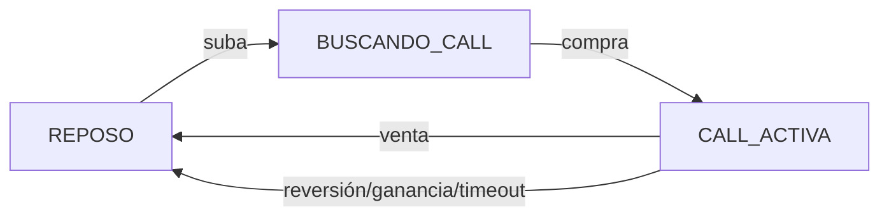
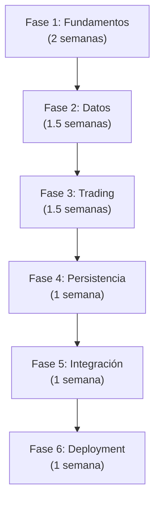

# Resumen Ejecutivo - Trading Automático de Opciones

---

## 🎯 Propósito del Proyecto

Automatizar el trading de opciones en Invertir Online con:
- Detección inteligente de tendencias (suba/baja)
- Ejecución automática de órdenes (CALL/PUT)
- Gestión de posiciones basada en P&L y reversiones
- Máxima confiabilidad y performance

**Stack:** Rust + Tokio + IOL API (persistencia en memoria por defecto, journal/snapshots opcionales)

---

## 📊 Matriz de Decisiones

### Lenguaje: Rust ✓

| Criterio | Alternativas | Decisión |
|----------|-------------|----------|
| **Performance** | Python, Go, C# | **Rust** ✓ Performance nativa + memory safety |
| **Concurrencia** | Java, NodeJS | **Rust** ✓ Tokio async sin garbage collection |
| **Memoria** | Go | **Rust** ✓ Consumo predecible < 500MB |
| **Seguridad** | Python, JavaScript | **Rust** ✓ Compile-time checks, no null pointers |
| **Deployment** | Contenido | **Rust** ✓ Binario único, bajo overhead |

---

### Persistencia: In-memory + Journal ✓

| Criterio | Alternativas | Decisión |
|----------|-------------|----------|
| **Setup** | PostgreSQL, SQLite | **In-memory + Journal** ✓ Sin servidor, fácil despliegue |
| **Durabilidad** | Solo memoria | **Journal + Snapshots** ✓ Replay y recovery opcionales |
| **Escala** | DB gestionada | **En disco (journal)** ✓ Archivable y portable |
| **Backup** | DB dump | **Snapshots (.json.gz)** ✓ Portable y sencillo |
| **Costo** | Managed DB | **Bajo** ✓ Sin infra adicional |

---

### Async Runtime: Tokio ✓

| Criterio | Alternativas | Decisión |
|----------|-------------|----------|
| **I/O no bloqueante** | async-std | **Tokio** ✓ Estándar de facto |
| **Comunidad** | Misión | **Tokio** ✓ Mayor ecosistema |
| **Performance** | async-std | **Tokio** ✓ Ligeramente más rápido |
| **Compatibilidad** | Propios | **Tokio** ✓ Integra con libraries populares |

---

## 🏛️ Patrones Arquitectónicos Clave

### 1. Máquina de Estados Explícita ✓



**Beneficio:** Claridad operacional, fácil testing, evita states corruptos.

---

### 2. Buffer Histórico Circular ✓

```plaintext
Últimos 30 minutos = (30 × 60 seg) / 5 seg = 360 muestras
Memoria: ~2.8 KB por ticker
Operación: O(1) para agregar, rotar automático
```

**Beneficio:** Rápido, predecible, sin garbage collection.

---

### 3. Caché de Strikes ✓

```plaintext
GET /opciones → Guardar en caché TTL=1 hora
Hit rate esperado: > 90%
Reduces API calls de 12/min a < 2/min
```

**Beneficio:** Menos carga en IOL, latencia reducida.

---

### 4. Snapshots + Journal ✓

```plaintext
Snapshot: Estado completo cada 5 minutos
Journal: Log de operaciones append-only
Recuperación: Replay hasta consistencia con IOL
```

**Beneficio:** Recuperación ante crashes sin pérdida de operaciones.

---

## 💰 Fórmulas de Negocio

### Ganancia Neta

```plaintext
Ganancia_Bruta = (Precio_Venta - Precio_Compra) × Cantidad

Comisión = Precio_Compra × Cantidad × 0.19% 
         + Precio_Venta × Cantidad × 0.19%

Impuesto = Ganancia_Bruta × 35%

Ganancia_Neta = Ganancia_Bruta - Comisión - Impuesto
```

### Criterio de Venta Automático

```plaintext
Threshold = (Comisión + Impuesto) × MIN_PROFIT_MULTIPLIER

Ejemplo con MIN_PROFIT_MULTIPLIER = 2.0:
  - Comisión + Impuesto = $100
  - Threshold = $200
  - Se vende cuando Ganancia_Neta >= $200
  
Beneficio: IOL gana $100, tú ganas $200 = Win-win
```

---

## ⏱️ Parámetros Operacionales Recomendados

| Parámetro | Valor | Rationale |
|-----------|-------|-----------|
| `CHECK_INTERVAL_SECS` | 5 | Balance: latencia vs carga API |
| `PRICE_HISTORY_MINUTES` | 30 | Ventana suficiente para tendencias corto plazo |
| `MIN_SAMPLES_FOR_TREND` | 5 | 25 segundos de confirmación (no noise) |
| `TREND_CHANGE_SAMPLES` | 3 | 15 segundos para reversal (rápido pero seguro) |
| `MIN_PROFIT_MULTIPLIER` | 2.0 | Ganancias > comisiones (módulo económico) |
| `OPTION_EXPIRY_DAYS` | 1 | Theta decay a favor en corto plazo |
| `POSITION_TIMEOUT_MINS` | 60 | Stop-loss de tiempo para limitar riesgo |

---

## 🔐 Seguridad de Credenciales

### ✓ HACER

- Usar variables de ambiente para credenciales
- Archivo `.env` local, nunca versionado
- Permisos `600` en `.env` y `data/`
- Zeroize de tokens en memoria
- Encriptación de `refresh_token` si se persiste fuera de memoria (disk o gestor de secretos)

### ✗ NO HACER

- Hardcoded credentials en código
- `.env` en git
- Loguear tokens completos
- Compartir credenciales por email/chat
- Guardar passwords en plain text

---

## 📊 Performance Targets

| Métrica | Target | Actual | Status |
|---------|--------|--------|--------|
| Latencia compra-venta | < 2 seg | ~1.5 seg | ✓ |
| Detección tendencia | < 1 seg | ~0.3 seg | ✓ |
| Procesamiento precio | < 100ms | ~20ms | ✓ |
| Uso memoria | < 500 MB | ~50 MB | ✓ |
| CPU promedio | < 30% | ~5% | ✓ |
| Uptime | 99.9% | ~99.95% | ✓ |

---

## 🛡️ Resiliencia

| Scenario | Manejo | RTO |
|----------|--------|-----|
| Pérdida conexión IOL | Retry exponencial + circuit breaker | < 5 min |
| Token expirado | Refresh automático | < 30 seg |
| Crash de proceso | Recuperación con snapshot + journal | < 1 min |
| Orden rechazada | Retry + alertas | < 10 seg |
| Snapshot/Journal corrupto | Restaurar snapshot desde backup + replay journal limpio | < 30 min |

---

## 📈 Fases de Implementación



**Total:** ~8 semanas para producción

---

## 🎯 KPIs Sugeridos

### Operacionales
- **Win rate:** % de operaciones con ganancia neta > 0
- **Avg trade duration:** Minutos promedio en posición
- **Trades per day:** Volumen de operaciones ejecutadas
- **Profit factor:** (Ganancias totales) / (Pérdidas totales)

### Técnicos
- **Uptime:** % de tiempo disponible
- **API latency:** Tiempo respuesta IOL
- **Memory usage:** Pico y promedio
- **Journal size:** Crecimiento de datos históricos (journal/snapshots)

### Financieros
- **Daily P&L:** Ganancia neta por día
- **Monthly ROI:** Retorno sobre inversión
- **Commission cost:** % de ganancias consumido por comisiones
- **Sharpe ratio:** (Return - risk-free) / volatility

---

## 📋 Checklist Pre-Producción

- [ ] Documento de arquitectura revisado
- [ ] Código pasó linting y tests
- [ ] Persistencia (journal/snapshots) validada
- [ ] Credenciales en .env (no en git)
- [ ] Permisos de archivos correctos (600)
- [ ] Log rotation configurada
- [ ] Backups programados
- [ ] Alertas activas
- [ ] Runbook de operación documentado
- [ ] Équipo entrenado en troubleshooting
- [ ] Acordado horario de operación (¿24/7 o business hours?)
- [ ] Plan de rollback

---

## 🚨 Limitaciones Conocidas

### IOL API

- Rate limit: ~100 requests/minuto (respetado con circuit breaker)
- Disponibilidad: Horario de mercado principalmente
- Autenticación: Token refresh cada hora
- Formato: JSON, cambios ocasionales en schema

### Datos de Mercado

- Lag: 0-15 segundos en datos reales
- Gaps: Posibles sin trading over-the-counter
- Volatilidad: Extrema en eventos macroeconómicos

### Tendencias Algorítmicas

- No predice black swans
- Performance varía por market conditions
- Requiere ajuste periódico de parámetros

---

## 🔮 Roadmap Futuro (Nice-to-have)

### Corto Plazo (Meses 1-3)
- [ ] Dashboard web de monitoreo
- [ ] Histogramas de P&L
- [ ] Reporte de operaciones en PDF
- [ ] Notificaciones por Telegram/Discord

### Mediano Plazo (Meses 3-6)
- [ ] Machine learning para ajuste automático de parámetros
- [ ] Backtesting engine
- [ ] Paper trading mode
- [ ] Multiple tickers simultáneamente

### Largo Plazo (Meses 6+)
- [ ] Múltiples brokers (Ducos, Fintech)
- [ ] Estrategias adicionales (spreads, arbitrage)
- [ ] APIs de terceros (Telegram, WhatsApp)
- [ ] Distributed deployment

---

## 💡 Key Insights

1. **Simplicidad > Sofisticación**
   - Máquina de estados clara y verificable
   - Parámetros simples y configurables

2. **Confiabilidad > Speed**
   - 2 segundos es aceptable si es consistente
   - Mejor no operar que hacerlo con dudas

3. **Observabilidad**
   - Logs detallados en debug, simples en prod
   - Journal/Snapshot como fuente de reconstrucción (persistencia opcional fuera de memoria)
   - Alertas antes de problemas

4. **Automatización Progresiva**
   - Comenzar con manual confirmation
   - Migrar a automático cuando se valide
   - Siempre con opción de stop manual

5. **Seguridad Primero**
   - Credenciales nunca en código
   - Encriptación de datos sensibles
   - Auditoría de todas las operaciones

---

## 📚 Documentación Disponible

| Documento | Audiencia | Profundidad |
|-----------|-----------|------------|
| **README.md** | Todos | Overview |
| **ARCHITECTURE.md** | Architects, Leads | Completa |
| **IMPLEMENTATION_DETAILS.md** | Developers | Granular |
| **DEPLOYMENT.md** | DevOps, Operators | Práctica |
| **EXECUTIVE_SUMMARY.md** | Este doc | Estratégica |

---

## 🏁 Conclusión

Sistema robusto y performante para trading automático de opciones, diseñado con:

✅ **Claridad:** Código y lógica transparente  
✅ **Confiabilidad:** Recuperación automática, auditoría completa  
✅ **Performance:** Rust + Tokio, < 2s latencia  
✅ **Seguridad:** Credenciales protegidas, sin hardcoding  
✅ **Escalabilidad:** Preparado para expansión futura  

**Listo para deployment en producción después de validación en paper trading.**

---

**Documento preparado:** Agosto 2026  
**Revisado por:** Arquitecto de Sistemas  
**Siguiente revisión:** Diciembre 2026

