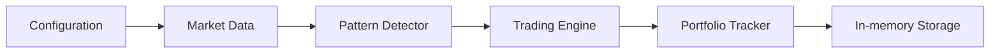

# Trading Automático de Opciones - IOL

**Sistema automático de trading de opciones en Invertir Online, desarrollado en Rust.**

## 📋 Documentos de Arquitectura

### 1. **ARCHITECTURE.md** - Visión General (634 líneas)
Documento técnico principal que cubre:
- ✅ Arquitectura general del sistema
- ✅ Componentes principales y sus responsabilidades
- ✅ Flujos de negocio (detección de tendencia, ejecución, cierre)
- ✅ Requisitos no funcionales (performance, estabilidad, confiabilidad)
- ✅ Seguridad y manejo de credenciales
- ✅ Estructura de directorios propuesta
- ✅ Dependencias principales
- ✅ Decisiones arquitectónicas justificadas
- ✅ Plano de implementación por fases
- ✅ Estrategia de testing

**Público:** Arquitectos, Senior Developers, Tech Leads

---

### 2. **IMPLEMENTATION_DETAILS.md** - Detalles Técnicos (715 líneas)
Especificación granular de implementación:
- ✅ Configuración y validación en startup
- ✅ Autenticación OAuth 2.0 con IOL
- ✅ Gestión de datos de precio (buffer, caché, validación)
- ✅ Algoritmo de detección de tendencia (SMA, R², volatilidad)
- ✅ Máquina de estados del trading (transiciones, condiciones)
- ✅ Gestión de órdenes (compra, venta, validación)
- ✅ Schema SQL completo (4 tablas principales)
- ✅ Recuperación ante fallos (snapshots, journal)
- ✅ Manejo de errores y resiliencia
- ✅ Optimizaciones de performance
- ✅ Estrategias de testing con mocks

**Público:** Developers, DevOps, QA

---

### 3. **DEPLOYMENT.md** - Operación y Producción (550+ líneas)
Guía práctica de deployment y monitoreo:
- ✅ Preparación de ambiente
- ✅ Inicialización de base de datos
- ✅ Validación pre-lanzamiento (checklist)
- ✅ Ejecución local (debug y release)
- ✅ Deployment en servidor Linux (systemd)
- ✅ Containerización con Docker y Docker Compose
- ✅ Monitoreo en producción
- ✅ Mantenimiento (rotación logs, backups)
- ✅ Troubleshooting (problemas comunes)
- ✅ Rollback a versión anterior
- ✅ Seguridad (permisos, encriptación)

**Público:** DevOps, SRE, Operators

---

## 🎯 Características Principales

### Trading
- 📊 Detección automática de tendencias (suba/baja) con confirmación de muestras
- 📈 Compra de CALL en tendencias alcistas
- 📉 Compra de PUT en tendencias bajistas
- 💰 Cierre de posición por ganancia mínima (covering de comisiones)
- 🔄 Cierre por reversión de tendencia
- ⏱️ Cierre por timeout de posición

### Configurabilidad
- 🎛️ Ticker configurable (GAL, GGAL, MERV, etc.)
- ⏰ Intervalo de chequeo de precio
- 📐 Períodos y muestras de tendencia
- 💵 Comisiones y impuestos
- 📊 Ganancia mínima para cierre

### Operación
- 🔐 Autenticación OAuth 2.0 segura
- 📡 Manejo robusto de red (retry, circuit breaker)
- 🧠 Persistencia en memoria (estado en memoria, snapshots opcionales)
- 📋 Auditoría completa de operaciones
- 🚨 Alertas y monitoreo
- 🔄 Recuperación ante crashes

### Performance
- ⚡ Latencia < 2 segundos compra-venta
- 🧠 Memoria < 500 MB
- 🔋 CPU promedio < 30%
- 🔁 Async/await con Tokio
- 📦 Caché inteligente de datos

---

## 📐 Arquitectura Simplificada

Interfaz: uso de ratatui para la TUI. La UI muestra todos los indicadores clave de forma clara y simple: precio actual, SMA, volatilidad, P&L hipotético, posición activa, tiempo en posición y umbrales. Logs: salida simple y profesional usando tracing (niveles info/warn/error). Además se mantiene un journal/trace append-only de operaciones para auditoría y replay.





---

## 🚀 Quick Start

### 1. Instalación
```bash
git clone <repo-url>
cd proyecto-options-trading
cp .env.example .env
nano .env  # Editar con tus credenciales
cargo build --release
```

### 2. Persistencia y modo por defecto
No se requiere inicializar una base de datos. El sistema mantiene el estado y el histórico en memoria y ofrece snapshots opcionales a disco para recuperación. Por defecto el binario corre en modo "fake" (simulación): no envía compras/ventas reales pero calcula y muestra el P&L hipotético según los parámetros actuales.

```bash
# Modo por defecto (fake/simulación)
RUST_LOG=info cargo run

# Para ejecutar órdenes reales (requiere credenciales y responsabilidad)
MODE=live RUST_LOG=info cargo run
```


### 3. Ejecutar
```bash
# Modo debug
RUST_LOG=debug cargo run

# Modo producción
./target/release/options-trading
```

### 4. Deploy (systemd)
```bash
sudo cp target/release/options-trading /usr/local/bin/
sudo systemctl enable trading-bot
sudo systemctl start trading-bot
```

---

## 📊 Configuración Esencial

| Variable | Ejemplo | Descripción |
|----------|---------|-------------|
| `TICKER` | GAL | Acción a operar |
| `CHECK_INTERVAL_SECS` | 5 | Chequeo cada 5 segundos |
| `MIN_SAMPLES_FOR_TREND` | 5 | Confirmar tendencia con 5 muestras |
| `MIN_PROFIT_MULTIPLIER` | 2.0 | Vender si ganancia = 2 × (comisión + impuesto) |
| `COMMISSION_PERCENTAGE` | 0.19 | Comisión IOL |
| `TAX_PERCENTAGE` | 35 | Impuesto ganancias |
| `OPTION_EXPIRY_DAYS` | 1 | Preferencia vencimiento opciones |
| `POSITION_TIMEOUT_MINS` | 60 | Cierre forzado después de 60 min |

---

## 🏗️ Estructura del Proyecto

```
proyecto-options-trading/
├── src/
│   ├── main.rs                 # Punto de entrada
│   ├── config/                 # Configuración
│   ├── market/                 # Datos de mercado
│   │   ├── iol_client.rs       # Cliente IOL
│   │   ├── price_stream.rs     # Buffer de precios
│   │   └── cache.rs            # Caché
│   ├── pattern/                # Detector de tendencias
│   ├── trading/                # Motor de trading
│   ├── portfolio/              # Seguimiento de posiciones
│   ├── persistence/            # Persistencia (in-memory + journal)
│   └── utils/                  # Utilidades
├── tests/                      # Tests
├── docs/
│   ├── ARCHITECTURE.md         # Este documento
│   ├── IMPLEMENTATION_DETAILS.md
│   └── DEPLOYMENT.md
└── scripts/                    # Scripts auxiliares
```

---

## 🔒 Seguridad

- ✅ Credenciales en variables de ambiente (nunca hardcoded)
- ✅ Tokens con Zeroize (limpiar de memoria)
- ✅ Autenticación OAuth 2.0
- ✅ HTTPS con verificación de certificados
- ✅ Auditoría completa en el journal (./data/journal/*.jsonl)
- ✅ Permisos restrictivos en archivos sensibles

---

## 📈 Performance

- **Latencia de compra:** < 2 segundos
- **Detección de tendencia:** < 1 segundo
- **Uso de memoria:** < 500 MB
- **CPU promedio:** < 30%
- **Disponibilidad:** 99.9% (con recuperación automática)

---

## 🧪 Testing

- **Unitarios:** Lógica de tendencia, P&L, máquina de estados
- **Integración:** Cliente IOL, ciclo completo trading
- **E2E:** Ambiente de testing con IOL (si disponible)
- **Mocks:** IOL API simulada para tests

---

## 📊 Monitoreo

### Logs en Tiempo Real
```bash
# Systemd
journalctl -u trading-bot -f

# Local
tail -f logs/trading-bot.log
```

### Métricas Diarias
```bash
# Usando el journal (concatenando JSONL) y jq para agregados diarios
cat ./data/journal/*.jsonl | jq -s '
  map(.timestamp = (.timestamp // "") | .date = (.timestamp | split("T")[0]))
  | group_by(.date)
  | map({date: .[0].date, operaciones: length, ganancia_neta: (map(.pnl_net // 0) | add)})'
```

---


---

## ⚠️ Disclaimers

- **No es asesoramiento financiero.** Úsalo bajo tu propio riesgo.
- **Testea en ambiente paper/demo primero.**
- **Monitorea regularmente** las operaciones.
- **Mantén backups** de datos operacionales.
- **Revisa logs** en caso de comportamiento inesperado.

---

## 📚 Documentos Relacionados

1. **ARCHITECTURE.md** - Diseño detallado y decisiones
2. **IMPLEMENTATION_DETAILS.md** - Especificación técnica granular
3. **DEPLOYMENT.md** - Guía de instalación y operación
4. **Code:** Comentarios en el código fuente
5. **Tests:** Casos de prueba como documentación ejecutable

---

## 🤝 Contribuir

Ver `CONTRIBUTING.md` para:
- Guidelines de código
- Proceso de pull requests
- Criterios de aceptación

---

## 📞 Soporte

- 🐛 Reportar bugs: GitHub Issues
- 📖 Preguntas: Revisar documentación primero
- 🚀 Mejoras: GitHub Discussions

---

## 📄 Licencia

Ver archivo `LICENSE`

---

**Última actualización:** Agosto 2026  
**Versión de Documentación:** 1.0

