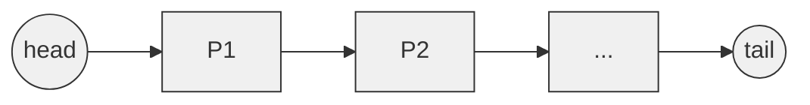
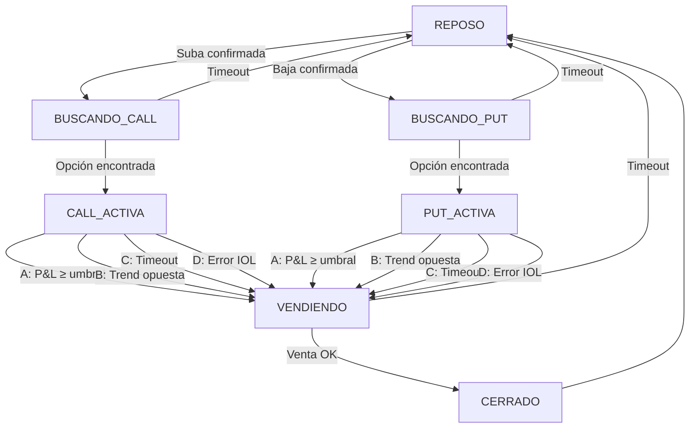

# Detalles de Implementación - Trading de Opciones Rust

Estado de implementacion:
- El motor continuo está implementado para `readonly` y `live`, ambos con etapas automáticas Learning y Live. Readonly sólo simula y avisa; live opera realmente sólo en su etapa Live.
- La UI ratatui muestra mercado, señal, posición, P&L, riesgo y eventos, con pausa, kill switch, cierre manual y snapshot.
- El cliente IOL soporta OAuth, refresh, retry/circuit breaker, parsing de cadena y envío de órdenes a una ruta configurada. Live requiere confirmación explícita y contrato HTTP verificado por el operador.

Notas de diseño:
- UI: ratatui/crossterm con precio, SMA, volatilidad, R², P&L, posición, límites, métricas y controles operativos.
- Logs: salida simple y profesional (tracing, niveles info/warn/error).
- Trace: journal append-only para auditoría y replay.
- Persistencia: sin base de datos por defecto — estado en memoria y snapshots opcionales.
- Modo por defecto: `readonly`, conectado a IOL y sin capacidad de enviar órdenes. `live` comparte el gate y habilita órdenes sólo después de aprobar Learning.
- Diagramas en la documentación generados con Mermaid para claridad y profesionalismo.


---

## 1. Módulo de Configuración - Especificación Detallada

### 1.1 Validación en Startup

```plaintext
Config::load()
  ├─ Leer variables de ambiente
  ├─ Aplicar valores por defecto
  ├─ Validar rangos:
  │   ├─ CHECK_INTERVAL_SECS: 1..60
  │   ├─ PRICE_HISTORY_MINUTES: 1..120
  │   ├─ MIN_SAMPLES_FOR_TREND: 2..100
  │   ├─ COMMISSION_PERCENTAGE: 0.01..1.0
  │   ├─ TAX_PERCENTAGE: 0..100
  │   ├─ MIN_PROFIT_MULTIPLIER: 1.0..10.0
  │   └─ LOG_LEVEL: debug|info|warn|error
  └─ Retornar Config validado o Error
```

### 1.2 Valores por Defecto Sugeridos

```plaintext
CHECK_INTERVAL_SECS=5              # Chequeo cada 5 segundos (balancer)
PRICE_HISTORY_MINUTES=30           # Últimos 30 minutos de histórico
MIN_SAMPLES_FOR_TREND=5            # 25 segundos de confirmación
TREND_CHANGE_SAMPLES=3             # 15 segundos para reversal
COMMISSION_PERCENTAGE=0.19         # IOL estándar
TAX_PERCENTAGE=35                  # Impuesto ganancias Argentina
MIN_PROFIT_MULTIPLIER=2.0          # Ganar 2x lo que cuesta la operación
OPTION_EXPIRY_DAYS=1              # Opciones corto plazo
```

---

## 2. Autenticación OAuth 2.0 con IOL

### 2.1 Flujo Inicial (Setup)

```plaintext
1. Usuario obtiene manualmente credenciales IOL
   
2. Bot realiza:
   POST /token
   Parámetros:
     - username
     - password
     - grant_type = "password"
   
3. IOL retorna:
   {
     "access_token": "...",      (1 hora típicamente)
     "refresh_token": "...",      (duración larga)
     "expires_in": 3600,
     "token_type": "Bearer"
   }

4. Guardar refresh_token de forma segura
   (encriptado en .env o gestor de secretos)
```

### 2.2 Refresh Automático

```plaintext
Antes de vencer el access token:
  ├─ POST /token
  │  Parámetros:
  │    - grant_type = "refresh_token"
  │    - refresh_token = stored_token
  │
  ├─ Recibir nuevo access_token
  │
  └─ Actualizar en memoria (zeroizar anterior)

Si request falla (401 Unauthorized):
  └─ Refresh inmediato (si NO es refresh_token expirado)
```

---

## 3. Gestión de Datos de Precio

### 3.1 Estructura del Buffer Histórico



### 3.2 Validación de Datos

```plaintext
Para cada precio recibido:

1. ¿Precio > 0?
   └─ No → Rechazar, loguear warning

2. ¿Timestamp >= último conocido?
   └─ No → Posible out-of-order, validar contra IOL

3. ¿Bid <= Ask?
   └─ No → Inconsistencia, usar último conocido

4. ¿|Precio - últimoConocido| > 50%?
   └─ Posible gap de mercado, pero aceptar
   └─ Loguear evento para análisis

5. Agregar a buffer
```

---

## 4. Lógica de Detección de Tendencia

### 4.1 Algoritmo Detallado

```plaintext
FUNCIÓN detectar_tendencia():
  
  Input: buffer_precios[últimas N muestras]
  
  1. Calcular SMA (Simple Moving Average):
     sma = Σ(buffer_precios) / len(buffer_precios)
  
  2. Evaluar dirección actual:
     precio_actual = buffer_precios[-1]
     
     if precio_actual > sma * 1.001:
       dirección_actual = SUBA
     else if precio_actual < sma * 0.999:
       dirección_actual = BAJA
     else:
       dirección_actual = NEUTRA
  
  3. Verificar confirmación:
     if dirección_actual == NEUTRA:
       Reset contador
       return NEUTRA
     
     if dirección_actual == última_dirección:
       contador_confirmación++
     else:
       contador_confirmación = 1
       última_dirección = dirección_actual
  
  4. Si contador_confirmación >= MIN_SAMPLES_FOR_TREND:
     return CONFIRMADA: {
       dirección: dirección_actual,
       fuerza: calcular_r_cuadrado(),
       muestras: contador_confirmación
     }
     else:
       return PARCIAL: { dirección, muestras }

FUNCIÓN detectar_cambio_de_tendencia():
  
  Input: posición_activa (CALL o PUT)
  
  1. Obtener últimas TREND_CHANGE_SAMPLES
  
  2. Contar cuántas van en dirección opuesta a posición:
     muestras_opuestas = 0
     for cada precio en últimas TREND_CHANGE_SAMPLES:
       if (posición=CALL y precio<SMA) o (posición=PUT y precio>SMA):
         muestras_opuestas++
  
  3. if muestras_opuestas >= TREND_CHANGE_SAMPLES:
       return TRUE  (se invirtió)
     else:
       return FALSE
```

### 4.2 Métricas de Fuerza

```plaintext
R² (Coeficiente de Determinación):
  
  SS_residual = Σ(precio_i - SMA)²
  SS_total = Σ(precio_i - media_global)²
  R² = 1 - (SS_residual / SS_total)
  
  Rango: 0 a 1
  - R² > 0.8: Tendencia fuerte ✓
  - 0.5 < R² ≤ 0.8: Tendencia moderada
  - R² ≤ 0.5: Tendencia débil

Volatilidad:
  σ = √(Σ(precio_i - SMA)² / N)
  
  Útil para ajustar dinámicamente MIN_SAMPLES_FOR_TREND
  Volatilidad alta → requerir más muestras
```

---

## 5. Motor de Trading - Máquina de Estados

### 5.1 Estados y Transiciones Detalladas



### 5.2 Transiciones Detalles de Condiciones

**Condición A: P&L Alcanzado**
```plaintext
Ganancia_Neta = (Precio_Venta - Precio_Compra) × Contratos
                - Comisión_Doble 
                - Impuesto

Threshold = Comisión_Doble × MIN_PROFIT_MULTIPLIER

if Ganancia_Neta >= Threshold:
  → VENDER
```

**Condición B: Cambio de Tendencia**
```plaintext
if (posición=CALL y últimas TREND_CHANGE_SAMPLES muestran BAJA):
  → VENDER (Stop por cambio)

if (posición=PUT y últimas TREND_CHANGE_SAMPLES muestran SUBA):
  → VENDER (Stop por cambio)
```

**Condición C: Timeout**
```plaintext
tiempo_en_posición = ahora() - entrada_timestamp

if tiempo_en_posición > POSITION_TIMEOUT_MINS × 60:
  → VENDER (Stop loss por tiempo)
  → Loguear: "Posición cerrada por timeout"
```

**Condición D: Error en IOL**
```plaintext
if IOL retorna 5XX o conexión cae:
  → Wait 10s, retry una vez
  if sigue fallando:
    → VENDER (stop defensivo)
    → Alerta crítica
```

**Condición E: Calidad de mercado**
```plaintext
if antigüedad_cotización > MAX_MARKET_DATA_AGE_SECS:
  → Activar kill switch
  → No comprar ni vender usando esa cotización

spread_pct = (ask - bid) / ((ask + bid) / 2) × 100
if nueva entrada y spread_pct > MAX_OPTION_SPREAD_PERCENTAGE:
  → Activar kill switch
  → Rechazar compra

Una venta ya justificada por objetivo o stop puede continuar con spread amplio,
porque reduce exposición, siempre que la cotización no esté obsoleta.
```

---

## 6. Gestión de Órdenes

### 6.1 Ciclo Completo de Compra

```plaintext
1. BUSCAR OPCIÓN
   GET /api/v2/BCBA/Titulos/{ticker}/Opciones
   ├─ Parsear respuesta JSON
   ├─ Filtrar por vencimiento (OPTION_EXPIRY_DAYS)
   ├─ Ordenar por strike
   └─ Seleccionar strike más cercano a precio actual

2. VALIDAR DISPONIBILIDAD
   ├─ ¿Bid/Ask presentes?
   ├─ ¿Volumen suficiente?
   └─ ¿Precio < umbrales lógicos?

3. EJECUTAR COMPRA
   POST /api/v2/ordenes
   {
     "simbolo": "GALIO",
     "cantidad": MAX_POSITION_SIZE,
     "precio": ask_price,
     "operacion": "compra",
     "plazo": "inmediata",
     "tipo": "limite"
   }
   
   Response:
   {
     "numeroOperacion": "12345",
     "estado": "pendiente|ejecutada|rechazada",
     "cantidadEjecutada": 5,
     "precioEjecutado": 2.15
   }

4. VALIDAR EJECUCIÓN
   ├─ Poll /api/v2/ordenes/{numeroOperacion}
   │  cada 500ms, máximo 5 intentos
   ├─ Si "estado"="ejecutada": 
   │  ├─ Guardar en portfolio
   │  ├─ Estado → CALL/PUT ACTIVA
   │  └─ Iniciar monitoreo
   └─ Si timeout: 
      ├─ Log warning
      └─ Estado → REPOSO
```

### 6.2 Ciclo de Venta (Cierre)

```plaintext
1. OBTENER PRECIO ACTUAL
   GET /api/v2/Cotizaciones/Opciones/Todas/Argentina
   └─ Buscar símbolo y extraer precioCompra/precioVenta

2. CALCULAR P&L
   ganancia_bruta = (bid_price - precio_entrada) × cantidad
   comisión = (precio_entrada × qty × 0.19%) + (bid_price × qty × 0.19%)
   impuesto = ganancia_bruta × 35%
   ganancia_neta = ganancia_bruta - comisión - impuesto

3. VERIFICAR CONDICIÓN DE VENTA
   ├─ Es ganancia neta >= threshold?
   ├─ Se invirtió la tendencia?
   └─ ¿Timeout expirado?
   
   Si NO a todas → No vender, esperar

4. EJECUTAR VENTA
   POST /api/v2/ordenes
   {
     "simbolo": "GALIO",
     "cantidad": cantidad_activa,
     "precio": bid_price,
     "operacion": "venta",
     "plazo": "inmediata",
     "tipo": "limite"
   }

5. CONFIRMACIÓN
   ├─ Poll estado orden
   ├─ Si ejecutada:
   │  ├─ Actualizar portfolio
   │  ├─ Calcular P&L final
   │  ├─ Grabar en journal (./data/journal/*.jsonl)
   │  └─ Estado → REPOSO
   └─ Si rechazada/timeout:
      ├─ Reintentar después de 5s
      ├─ Si falla segunda vez:
      │  ├─ Alerta crítica
      │  └─ Revisar manualmente en IOL
      └─ Intentar market order como último recurso
```

---

## 7. Persistencia - En memoria (sin DB)

El sistema no usa una base de datos por defecto. La persistencia se basa en estructuras en memoria y mecanismos opcionales de snapshot/journal para recuperación y auditoría.

### Diseño principal
- Estado en memoria: DashMap / Mutex-protected HashMap para posiciones, vector para buffer de precios y vectores/colas para el journal.
- Journal append-only (opcional): entradas serializadas (JSON) escritas en disco para permitir replay en caso de inconsistencia.
- Snapshots periódicos: serializar el estado completo a JSON mediante escritura temporal + rename atómico. Al iniciar, cargar el snapshot y reprocesar los eventos posteriores del journal.

### Estructuras clave (ejemplo conceptual)
- operations: Vec<OperationRecord> (operaciones históricas en memoria)
- positions: DashMap<PositionId, Position>
- trends: Vec<TrendRecord>
- journal: archivo append-only con entradas { timestamp, operation_id, action, details }

### Ventajas
- Simplicidad operacional (no requiere DB ni migraciones)
- Muy rápido para desarrollo y testing local
- Control total sobre el formato de snapshot/journal

### Consideraciones para producción
- Si se requiere durabilidad fuerte o múltiples instancias, integrar un backend persistente (ej. servicio separado, base de datos o cola). El diseño de la lógica de trading no debe depender directamente de un DB relacional; soportar adaptadores si es necesario.

---

## 8. Recuperación ante Fallos

### 8.1 Snapshot del Estado

```plaintext
Cada 5 minutos:

snapshot = {
  timestamp: now(),
  state_machine: estado_actual,
  active_positions: [todas],
  buffer_precios: [últimas 50],
  config: configuración_vigente,
  last_operation_id: ID
}

Guardado en:
  1. Archivo JSON atómico: state.json

Uso en recuperación:
  - Si bot se reinicia: cargar snapshot más reciente
  - Reproducir journal desde last_operation_id
  - Restaurar posiciones activas
  - Validar contra IOL API
  - Continuar operación
```

### 8.2 Journal de Operaciones

```plaintext
Cada operación (compra o venta):

journal_entry = {
  timestamp: exacto,
  operation_id: UUID único,
  action: "BUY" | "SELL",
  details: {...},
  confirmation: bool  (recibido de IOL)
}

Almacenamiento: Append-only log
Beneficio: Replay ante inconsistencias

Validación en startup:
  ├─ Leer journal
  ├─ Comparar con snapshot si existe
  ├─ Comparar con IOL (últimas 10)
  └─ Alertar si hay discrepancias
```

---

## 9. Manejo de Errores y Resiliencia

### 9.1 Errores de Red

| Error | Manejo | Retry |
|-------|--------|-------|
| Timeout | Log, Wait 1s | Exp. backoff |
| 429 (Rate Limit) | Wait 60s | Una vez |
| 5XX | Log, Wait 5s | 3 intentos |
| DNS fail | Log crítico | Con delay |
| Connection reset | Auto-reconnect | Exp. backoff |

### 9.2 Errores de Lógica

| Escenario | Decisión |
|-----------|----------|
| Orden rechazada | Log, estado → REPOSO |
| Precio inconsistente | Usar último conocido |
| Token expirado | Refresh automático |
| Comisión no disponible | Usar valor de config |
| Vencimiento opción expirado | Buscar próximo vencimiento |

---

## 10. Optimizaciones de Performance

### 10.1 Caché de Strikes

```plaintext
Problema: Consultar strikes cada ciclo es costoso

Solución:
  1. GET /api/v2/BCBA/Titulos/{ticker}/Opciones → Guardar catálogo en caché
  2. TTL: 1 hora (o cambio de precio > 5%)
  3. Hit rate esperado: > 90%
  4. Mem consumida: ~50KB por ticker
```

### 10.2 Batch de Cálculos

```plaintext
Evitar recalcular SMA completo:
  
  Construcción incremental:
    sma_nueva = ((sma_vieja × N) - precio_saliente + precio_entrante) / N
  
  Complejidad: O(1) en lugar de O(N)
```

### 10.3 Memoria Acotada

```plaintext
Buffer máximo: 360 muestras = ~2.8 KB
Posiciones: max 5 simultáneas = ~5 KB
Config: ~1 KB
Caché opciones: ~50 KB

Total: ~60 KB línea base + buffers
Target: < 200 MB pico
```

---

## 11. Testing

### 11.1 Mock de IOL API

```plaintext
Para tests unitarios:

mock_iol_server:
  - Respuestas predeterminadas por URL
  - Simulación de delays
  - Inyección de errores
  - Históricos de precios pre-cargados
  - Validación de órdenes

Ejemplo:
  GET /api/v2/BCBA/Titulos/GGAL/Opciones
  ├─ Call 1: Retorna [CALL 105@2.15, PUT 100@1.80]
  ├─ Call 2: Retorna [CALL 105@2.30]
  └─ Call 3: Retorna error 503 (para testear retry)
```

### 11.2 Escenarios de Tendencia

```plaintext
Test Case 1: Tendencia SUBA clara
  Precios: [100, 101, 102, 103, 104]
  Esperado: SUBA confirmada en muestras 5

Test Case 2: Cambio SUBA → BAJA
  Precios: [100, 101, 102, 103, 104, 103, 102, 101, 100]
  Esperado: BAJA después de 3 muestras inversas

Test Case 3: Tendencia débil (lateral)
  Precios: [100, 100.5, 99.8, 100.2, 99.9, 100.1]
  Esperado: NEUTRA (sin confirmación)
```

---

## 12. Monitoreo en Producción

### 12.1 Health Check

```plaintext
Cada 2 minutos:
  1. GET /api/v2/broker/estado → ¿API disponible?
  2. ¿Último precio tiene < 1 minuto?
  3. ¿Accesibilidad de persistencia (journal/snapshots)?
  4. ¿Memory usage < 80% del límite?
  
  Si falla:
    └─ Alerta + Intento de recovery
```

### 12.2 Alertas Críticas

```plaintext
Evento: BOT_DISCONNECTED
  └─ Trigger: Conexión a IOL cae > 5 min
  └─ Acción: Email + Slack (si configurado)

Evento: POSITION_ABANDONED
  └─ Trigger: Posición activa + sin monitoreo > 10 min
  └─ Acción: Forzar venta + alerta

Evento: UNUSUAL_PNL
  └─ Trigger: Pérdida > 20% en una operación
  └─ Acción: Log + revisión manual
```

---

**Documento de Implementación - v1.0**
